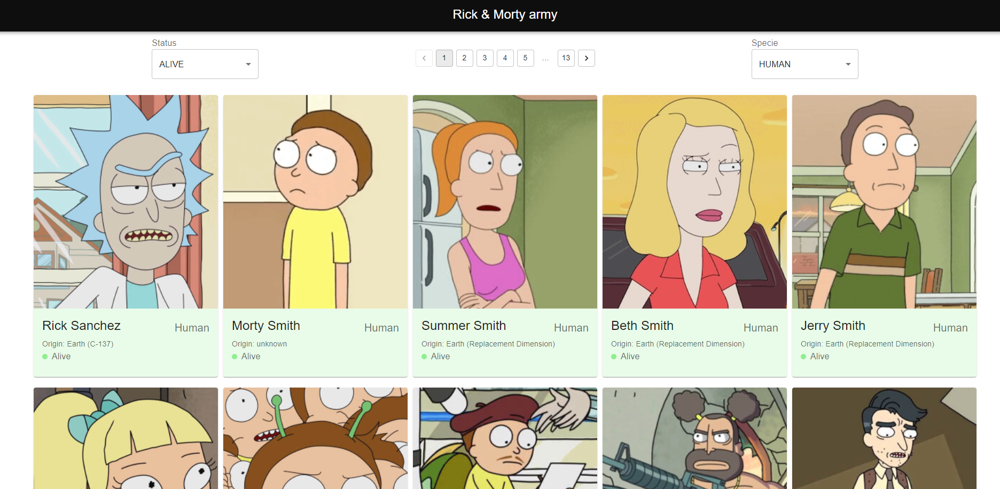

# Ciudadela test

## General

This project was made using turbo repo

## Backend

The backend is in the folder apps/server

I am using "express" to serve one enedpoint and "graphql-request" to consume the Rick & Morty graphql API

## Shared

Types where generated using "graphql-codegen" in packages/shared workspace, also the project is using a shared tsconfig files

## Frontend

The frontend is in the folder apps/web, was made using "Nextjs" & "Material UI"

## Run project instructions

In the root of the project install all deps using `npm install`, the next step is to compile the shared folder in the packages/shared folder with `npm run compile` , and the last step is to run the project with `npm run dev`, from the root.

### Project overview

